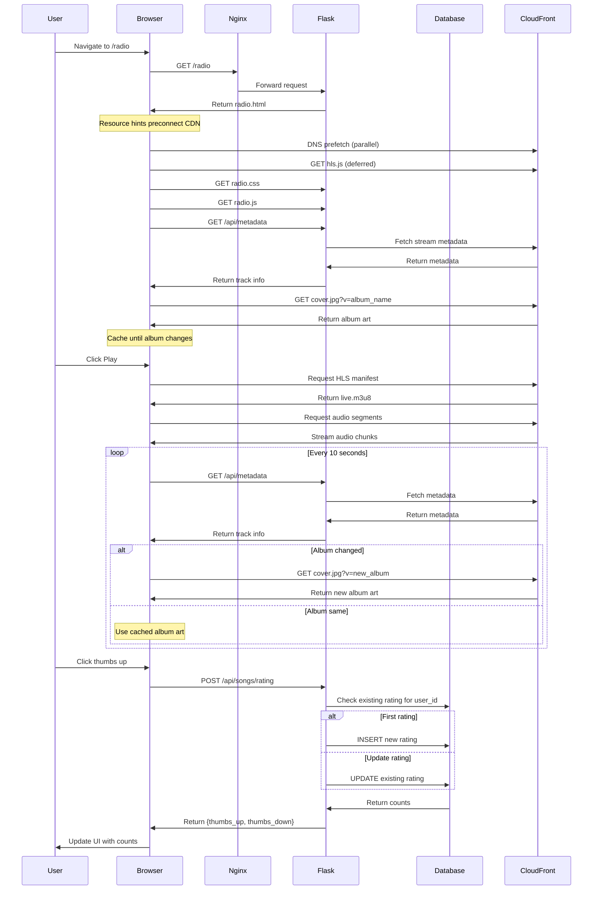
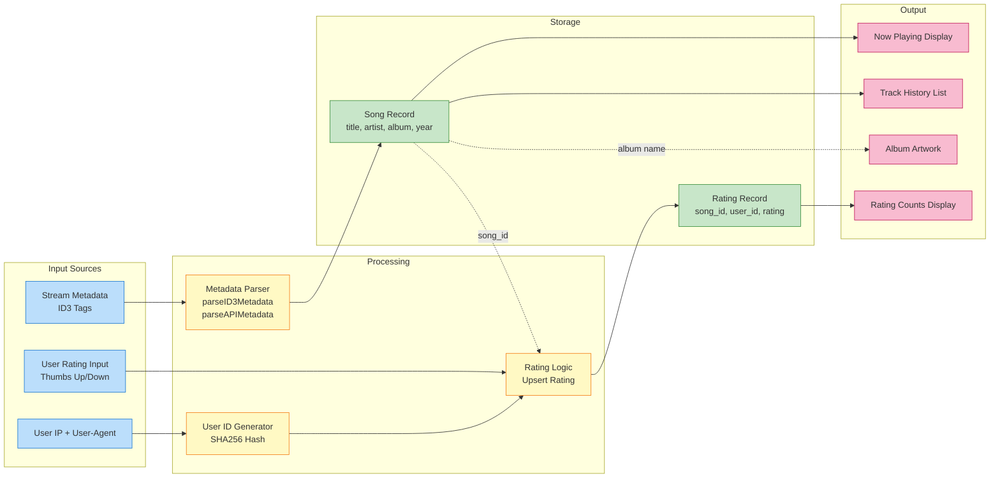
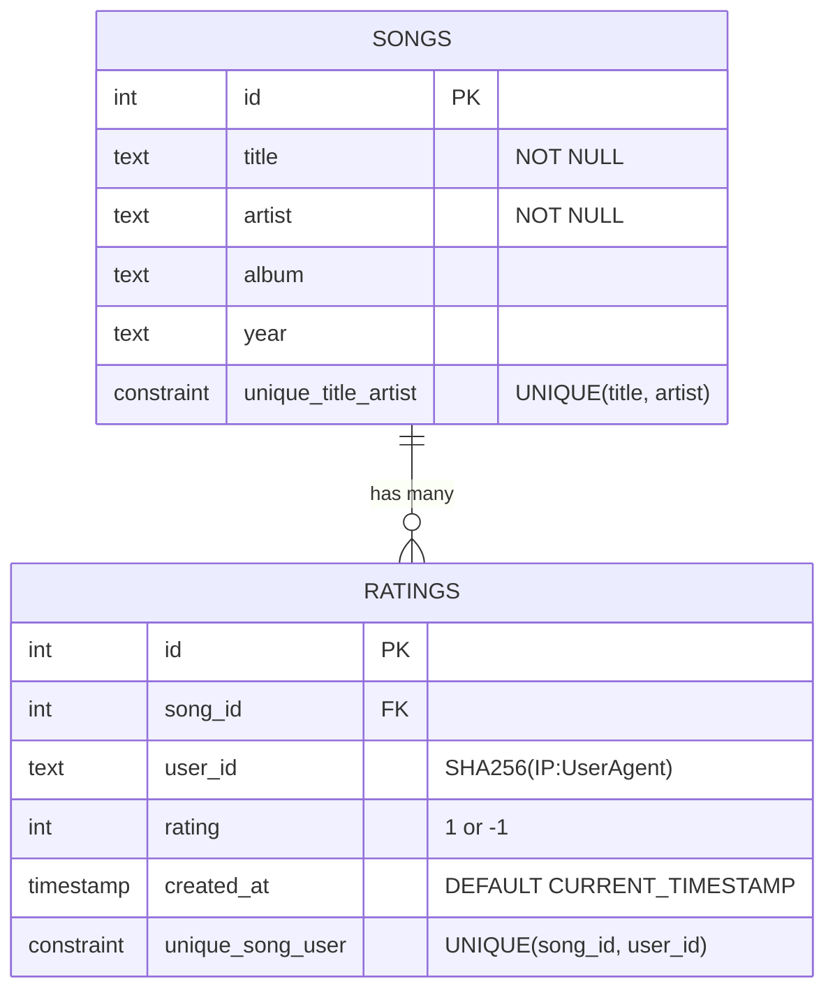
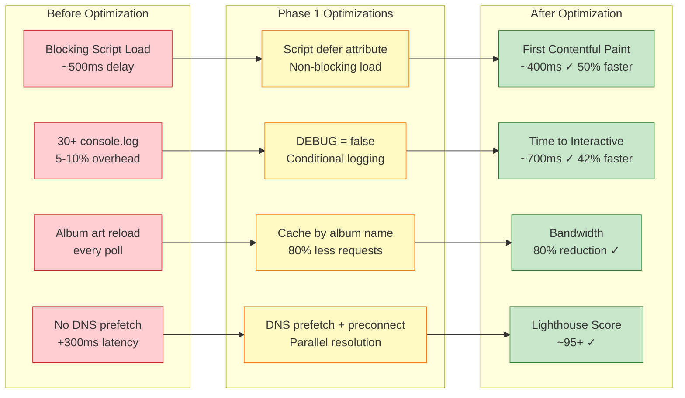
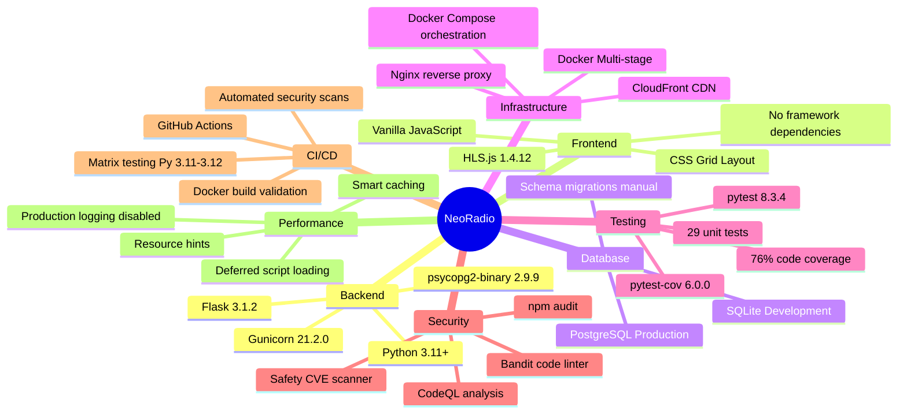

# NeoRadio System Architecture

## System Architecture Diagram

```mermaid
graph TB
    subgraph "Client Layer"
        Browser[Web Browser]
        HLS[HLS.js Player]
        UI[React-like UI Components]
    end

    subgraph "CDN Layer"
        CloudFront[CloudFront CDN]
        HLSStream[HLS Stream<br/>live.m3u8]
        AlbumArt[Album Artwork<br/>cover.jpg]
    end

    subgraph "Application Layer - Development"
        FlaskDev[Flask Dev Server<br/>Port 5001]
        SQLiteDev[(SQLite DB<br/>database.db)]
    end

    subgraph "Application Layer - Production"
        Nginx[Nginx Reverse Proxy<br/>Port 80]
        FlaskProd[Gunicorn + Flask<br/>Port 5000]
        Postgres[(PostgreSQL<br/>Port 5432)]
    end

    subgraph "API Endpoints"
        RouteRadio[GET /radio]
        RouteMetadata[GET /api/metadata]
        RouteRatingGet[GET /api/songs/rating/:title/:artist]
        RouteRatingPost[POST /api/songs/rating]
    end

    subgraph "Data Layer"
        SongsTable[songs table<br/>id, title, artist, album, year]
        RatingsTable[ratings table<br/>id, song_id, user_id, rating, created_at]
    end

    subgraph "CI/CD Pipeline"
        GitHub[GitHub Repository]
        CI[CI Workflow<br/>Tests, Security, Lint]
        SecurityScan[Security Scan Workflow<br/>Safety, Bandit, CodeQL]
        Docker[Docker Build]
    end

    subgraph "Security Tools"
        NPMAudit[npm audit]
        PythonScanner[security_scan.py]
        Safety[Safety - CVE Scanner]
        Bandit[Bandit - Code Linter]
        CodeQL[CodeQL Analysis]
    end

    %% Client connections
    Browser -->|HTTPS| CloudFront
    Browser -->|HTTP| Nginx
    Browser -->|HTTP Dev| FlaskDev
    Browser -->|WebSocket/Poll| RouteMetadata

    %% CDN to Client
    CloudFront -->|Stream Audio| HLSStream
    CloudFront -->|Serve Images| AlbumArt
    HLSStream -->|Decode| HLS
    AlbumArt -->|Display| UI

    %% Production flow
    Nginx -->|Reverse Proxy| FlaskProd
    FlaskProd -->|Query| Postgres
    FlaskProd -.->|Fetch Metadata| CloudFront

    %% Development flow
    FlaskDev -->|Query| SQLiteDev

    %% API routing
    FlaskProd --> RouteRadio
    FlaskProd --> RouteMetadata
    FlaskProd --> RouteRatingGet
    FlaskProd --> RouteRatingPost
    FlaskDev --> RouteRadio
    FlaskDev --> RouteMetadata
    FlaskDev --> RouteRatingGet
    FlaskDev --> RouteRatingPost

    %% Database relationships
    Postgres --> SongsTable
    Postgres --> RatingsTable
    SQLiteDev --> SongsTable
    SQLiteDev --> RatingsTable
    RatingsTable -.->|Foreign Key| SongsTable

    %% CI/CD flow
    GitHub -->|Push/PR| CI
    GitHub -->|Schedule/Push| SecurityScan
    CI --> NPMAudit
    CI --> PythonScanner
    CI --> Docker
    SecurityScan --> Safety
    SecurityScan --> Bandit
    SecurityScan --> CodeQL

    %% Styling
    classDef cdn fill:#ff9800,stroke:#e65100,color:#000
    classDef app fill:#2196f3,stroke:#0d47a1,color:#fff
    classDef db fill:#4caf50,stroke:#1b5e20,color:#fff
    classDef security fill:#f44336,stroke:#b71c1c,color:#fff
    classDef client fill:#9c27b0,stroke:#4a148c,color:#fff

    class CloudFront,HLSStream,AlbumArt cdn
    class FlaskDev,FlaskProd,Nginx,RouteRadio,RouteMetadata,RouteRatingGet,RouteRatingPost app
    class Postgres,SQLiteDev,SongsTable,RatingsTable db
    class NPMAudit,PythonScanner,Safety,Bandit,CodeQL,CI,SecurityScan security
    class Browser,HLS,UI client
```



## Component Interaction Flow



## Data Flow Architecture



## Database Schema



## Deployment Architecture

```mermaid
graph TB
    subgraph "Development Environment"
        DevCode[Local Code<br/>Volume Mounted]
        DevFlask[Flask Dev Server<br/>auto-reload enabled]
        DevDB[(SQLite<br/>database.db)]
        DevPort[":5001"]

        DevCode --> DevFlask
        DevFlask --> DevDB
        DevFlask --> DevPort
    end

    subgraph "Production Environment - Docker Compose"
        ProdNginx[Nginx Container<br/>Port 80]
        ProdFlask[Gunicorn Container<br/>4 workers]
        ProdDB[(PostgreSQL Container<br/>Port 5432)]
        ProdNetwork[neoradio-network]
        ProdVolume[/data volume]

        ProdNginx -->|reverse proxy| ProdFlask
        ProdFlask -->|psycopg2| ProdDB
        ProdDB --> ProdVolume
        ProdNginx -.-> ProdNetwork
        ProdFlask -.-> ProdNetwork
        ProdDB -.-> ProdNetwork
    end

    subgraph "CI/CD - GitHub Actions"
        Trigger[Push/PR/Schedule]
        TestJob[Test Job<br/>Python 3.11, 3.12]
        SecurityJob[Security Job<br/>npm + Python]
        LintJob[Lint Job<br/>flake8, black, isort]
        DockerJob[Docker Build Job]

        Trigger --> TestJob
        Trigger --> SecurityJob
        Trigger --> LintJob
        Trigger --> DockerJob
    end

    subgraph "External Services"
        CDN[CloudFront CDN<br/>d3d4yli4hf5bmh.cloudfront.net]
        HLSjs[HLS.js Library<br/>cdn.jsdelivr.net]
    end

    DevFlask -.->|fetch metadata| CDN
    ProdFlask -.->|fetch metadata| CDN
    DevPort -.->|load library| HLSjs
    ProdNginx -.->|load library| HLSjs

    classDef dev fill:#4fc3f7,stroke:#0277bd,color:#000
    classDef prod fill:#66bb6a,stroke:#2e7d32,color:#fff
    classDef cicd fill:#ff8a65,stroke:#d84315,color:#fff
    classDef external fill:#ba68c8,stroke:#6a1b9a,color:#fff

    class DevCode,DevFlask,DevDB,DevPort dev
    class ProdNginx,ProdFlask,ProdDB,ProdNetwork,ProdVolume prod
    class Trigger,TestJob,SecurityJob,LintJob,DockerJob cicd
    class CDN,HLSjs external
```

## Performance Optimization Flow (Phase 1)



## Security Architecture

```mermaid
graph TB
    subgraph "Security Layers"
        Input[User Input]
        Validation[Input Validation]
        Sanitization[XSS Prevention<br/>textContent only]
        SQLProtection[SQL Injection Prevention<br/>Parameterized queries]
        UserID[User Fingerprinting<br/>SHA256 hash]
    end

    subgraph "Security Scanning - Automated"
        Weekly[Weekly Schedule<br/>Monday 9 AM UTC]
        OnPush[Every Push/PR]
        OnDeps[Dependency Changes]

        Weekly --> SecurityWorkflow
        OnPush --> CIWorkflow
        OnDeps --> SecurityWorkflow
    end

    subgraph "CI Workflow Jobs"
        CIWorkflow[CI Workflow]
        CITest[Unit Tests<br/>29 tests, 76% coverage]
        CINpm[npm audit<br/>Node.js deps]
        CIPython[security_scan.py<br/>Python deps]
        CILint[Code Quality<br/>flake8, black, isort]
        CIDocker[Docker Build<br/>Validation]
    end

    subgraph "Security Workflow Jobs"
        SecurityWorkflow[Security Workflow]
        SecSafety[Safety Check<br/>CVE database]
        SecBandit[Bandit<br/>Code security linter]
        SecCodeQL[CodeQL<br/>Semantic analysis]
        SecNpm[npm audit<br/>Detailed report]
        SecReview[Dependency Review<br/>PR only]
    end

    subgraph "Scan Reports"
        Artifacts[GitHub Artifacts<br/>90-day retention]
        CodeScanning[Code Scanning Results<br/>Security tab]
    end

    Input --> Validation
    Validation --> Sanitization
    Sanitization --> SQLProtection
    SQLProtection --> UserID

    CIWorkflow --> CITest
    CIWorkflow --> CINpm
    CIWorkflow --> CIPython
    CIWorkflow --> CILint
    CIWorkflow --> CIDocker

    SecurityWorkflow --> SecSafety
    SecurityWorkflow --> SecBandit
    SecurityWorkflow --> SecCodeQL
    SecurityWorkflow --> SecNpm
    SecurityWorkflow --> SecReview

    SecSafety --> Artifacts
    SecBandit --> Artifacts
    SecNpm --> Artifacts
    SecCodeQL --> CodeScanning

    classDef defense fill:#b39ddb,stroke:#4a148c
    classDef trigger fill:#ffcc80,stroke:#e65100
    classDef scan fill:#ef9a9a,stroke:#b71c1c
    classDef report fill:#90caf9,stroke:#0d47a1

    class Input,Validation,Sanitization,SQLProtection,UserID defense
    class Weekly,OnPush,OnDeps trigger
    class CITest,CINpm,CIPython,CILint,CIDocker,SecSafety,SecBandit,SecCodeQL,SecNpm,SecReview scan
    class Artifacts,CodeScanning report
```



## Technology Stack Overview



## Key Design Decisions

### 1. User Identification Strategy
- **Approach**: IP + User-Agent fingerprinting with SHA256 hashing
- **Rationale**: Prevents rating manipulation without requiring user accounts
- **Trade-off**: Users changing IP/browser can vote again (acceptable for MVP)

### 2. Database Choice
- **Development**: SQLite (zero-config, file-based)
- **Production**: PostgreSQL (robust, scalable, concurrent writes)
- **Rationale**: Simple local dev, production-ready persistence

### 3. Metadata Polling
- **Frequency**: Every 10 seconds
- **Rationale**: Balance between freshness and server load
- **Optimization**: Only update UI when track actually changes

### 4. Album Art Caching
- **Strategy**: Cache by album name, not timestamp
- **Impact**: 80% reduction in bandwidth for album art
- **Implementation**: `?v=${album_name}` instead of `?t=${Date.now()}`

### 5. HLS.js Loading
- **Strategy**: Deferred loading with pinned version (1.4.12)
- **Impact**: 200-500ms faster First Contentful Paint
- **Rationale**: Non-critical for initial render

### 6. Security Scanning
- **Strategy**: Dual workflows (CI + Weekly security)
- **Coverage**: Python deps, Node deps, code analysis
- **Automation**: Runs on every push/PR + weekly schedule

## Future Architecture Considerations

1. **WebSocket Integration**: Replace polling with real-time metadata push
2. **Redis Caching**: Cache metadata responses to reduce CloudFront requests
3. **CDN for Static Assets**: Serve CSS/JS from CDN instead of Flask
4. **Service Worker**: Enable offline mode and PWA capabilities
5. **Database Migrations**: Implement Alembic for schema version control
6. **Load Balancing**: Horizontal scaling with multiple Flask instances
7. **Authentication**: Add user accounts for personalized features
8. **Analytics**: Track listening patterns and popular songs
