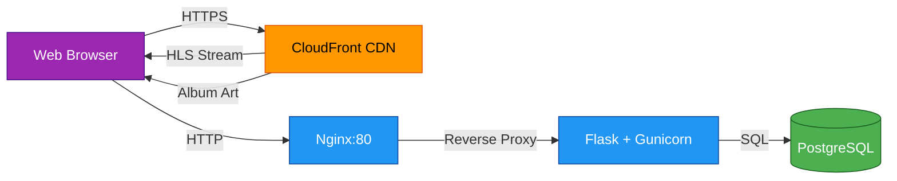

# NeoRadio

A modern web-based radio player for streaming HLS audio with live metadata display, track history, and community song ratings.

[](https://github.com/playground-x/neoradio/actions/workflows/ci.yml)
[](https://github.com/playground-x/neoradio/actions/workflows/security-scan.yml)


## Overview

NeoRadio is a Flask-based web application that provides a sleek, dark-themed interface for listening to live radio streams. Features include real-time track metadata, album artwork, an animated visualizer, and a community-driven rating system for songs.

## Architecture

NeoRadio uses a modern streaming architecture with HLS delivery, real-time metadata, and a secure rating system.



**For complete architecture documentation with 8 detailed diagrams, see [ARCHITECTURE.md](ARCHITECTURE.md)**

Key architectural features:
- **Optimised Performance**: Resource hints, deferred loading, smart caching (50% faster FCP)
- **Dual Environments**: SQLite for dev, PostgreSQL + Nginx for production
- **Security First**: Automated CI/CD with npm audit, Safety, Bandit, and CodeQL
- **IP Fingerprinting**: SHA256-based user identification for persistent ratings

## Features

- **HLS Audio Streaming** - Lossless quality streaming with auto-recovery from errors
- **Live Metadata** - Real-time track information (title, artist, album, year)
- **Album Artwork** - Auto-refreshing cover images for each track
- **Track History** - Last 10 played tracks with timestamps
- **Song Ratings** - Community thumbs up/down voting system
- **Animated Visualizer** - 40-bar audio visualization
- **Dark Theme** - Modern purple/blue gradient design
- **Responsive Layout** - Mobile-friendly grid design
- **IP-Based User Identification** - Persistent ratings without cookies

## Quick Start

### 1. Clone the Repository

```bash
git clone https://github.com/playground-x/neoradio.git
cd neoradio
```

### 2. Create Virtual Environment

**Windows:**
```bash
python -m venv venv
venv\Scripts\activate
```
Access at: http://localhost:5000/radio

**Linux/Mac:**
```bash
python3 -m venv venv
source venv/bin/activate
```
Access at: http://localhost/radio

### 3. Install Dependencies

### Local Development

### 4. Run the Application

2. **Run the application:**
   ```bash
   python app.py
   ```

The server will start at: **http://127.0.0.1:5000**

**Constraints:** UNIQUE(title, artist)

### ratings
| Column | Type | Description |
|--------|------|-------------|
| id | SERIAL/AUTOINCREMENT | Primary key |
| song_id | INTEGER | Foreign key to songs.id |
| user_id | TEXT | SHA256 hash of IP + User-Agent |
| rating | INTEGER | 1 (thumbs up) or -1 (thumbs down) |
| created_at | TIMESTAMP | Rating timestamp |

**Constraints:**
- UNIQUE(song_id, user_id) - Prevents duplicate ratings
- CHECK(rating IN (1, -1)) - Enforces valid rating values
- Foreign key cascade on delete

**PostgreSQL Performance Indexes:**
- `idx_ratings_song_id` on `ratings.song_id`
- `idx_ratings_user_id` on `ratings.user_id`
- `idx_songs_artist` on `songs.artist`
- `idx_songs_title` on `songs.title`

## User Identification

NeoRadio uses IP-based fingerprinting to prevent rating manipulation:

1. Extracts client IP (handles `X-Forwarded-For` for proxies)
2. Combines with User-Agent string
3. Creates SHA256 hash: `hashlib.sha256(f"{ip}:{user_agent}".encode())`
4. Uses first 32 characters as `user_id`

This approach:
- Prevents cookie clearing exploits
- Maintains user privacy through hashing
- Persists across browser sessions
- Requires IP/browser change to bypass

## Technology Stack

**Backend:**
- Flask 3.1.2 - Python web framework
- SQLite - Embedded database
- Requests 2.32.5 - HTTP library
- Gunicorn 21.2.0 - WSGI HTTP server (production)

**Frontend:**
- HLS.js - JavaScript HLS stream playback
- Vanilla JavaScript - No framework dependencies
- CSS Grid - Responsive layout

**Testing:**
- pytest 8.3.4 - Testing framework
- pytest-cov 6.0.0 - Coverage reporting

**Deployment:**
- Docker - Containerization
- Docker Compose - Multi-container orchestration

## Development

### Debug Mode
The server runs in debug mode by default:
- Auto-reloads on code changes
- Detailed error messages
- Interactive debugger

### Metadata Polling
JavaScript polls for metadata every 10 seconds to keep track info current.

### Database Auto-Initialization
The database is automatically created on first run with all required tables.

## Documentation

### Architecture & Design
- **[ARCHITECTURE.md](ARCHITECTURE.md)** - Complete system architecture with 8 interactive Mermaid diagrams
  - System overview, data flow, and deployment architecture
  - Component interactions and sequence diagrams
  - Database schema and security architecture
  - Performance optimisations and technology stack

### Technical Reference
- **[CLAUDE.md](CLAUDE.md)** - Detailed technical documentation
  - API endpoint specifications
  - Database schema details
  - Security considerations
  - Troubleshooting guide
  - Future enhancement ideas

### Security
- **[SECURITY.md](SECURITY.md)** - Security scanning guide
  - Running security scans (npm audit, Python security scanner)
  - CI/CD integration details
  - GitHub Actions workflows

## Contributing

Contributions are welcome! Please feel free to submit a Pull Request.
